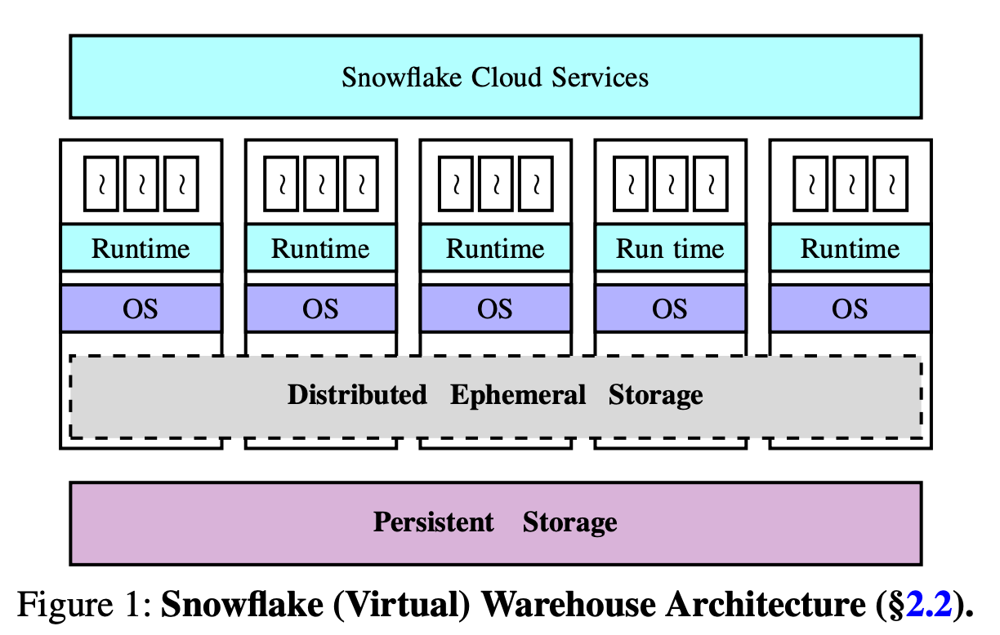
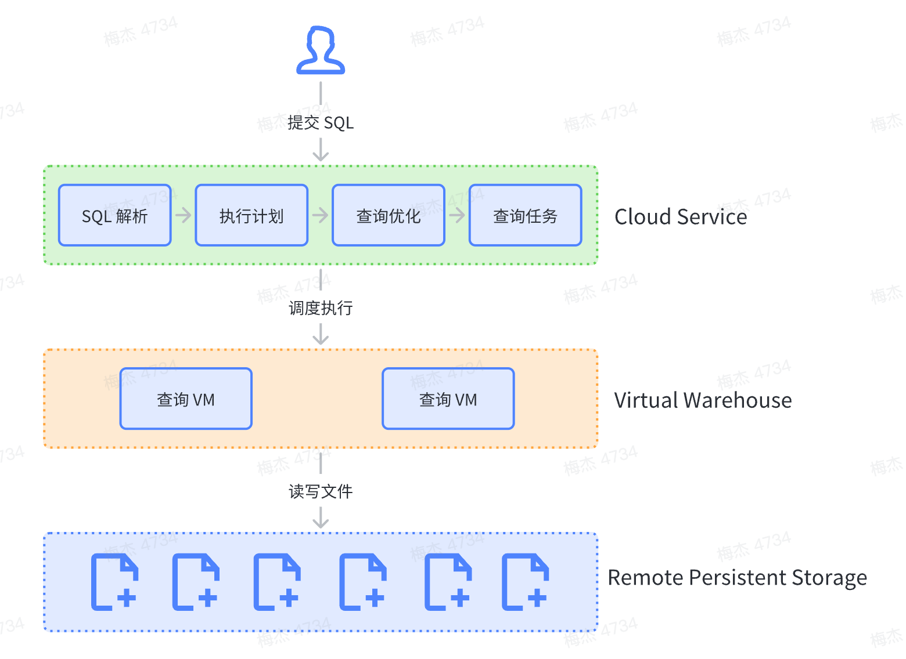

# [笔记] 在分离的存储上构建一个查询引擎

> 原论文 [Building An Elastic Query Engine on Disaggregated Storage](https://15721.courses.cs.cmu.edu/spring2023/papers/02-modern/vuppalapati-nsdi22.pdf)

## 设计动机

基于 Share Nothing 架构的查询执行引擎和数据仓库，通过分区和分片机制将数据均匀分布到整个集群，
在执行查询的时候，移动计算以获得最佳数据本地化(Data Locality), 从而获得很好的性能和扩展性。
不过，这种架构也存在一些劣势：

1. 缺少弹性: 静态数据布局导致静态计算调度，数据倾斜导致部分节点过载，并且难以横向扩展。
2. 资源错配: 在异构集群里 IO 密集型节点运行计算密集型任务。

因此，这类数据仓库需要根据负载峰值提前预测和规划计算资源和集群容量，导致很低的资源利用率。

## 设计决策

基于上面的分析，得出了核心问题：**存储计算耦合，静态数据布局导致系统无法利用云计算弹性伸缩的优势**，
给出了两个设计决策：

1. 专门设计一个临时存储系统管理查询执行过程中的临时跨节点数据交换
2. 这个临时存储系统同时为持久化存储提供了一个 write-through 缓存。

**决策客观数据**:

1. 只读查询，只写查询，读写查询比例：~28%，~13%，~59%.
2. 不同查询的中间件数据大小有几个数量级的差异，甚至有 TB 级别的中间件交换。
3. 数据访问倾斜产生较高的缓存命中率（60%~80%），旧数据很少访问。
4. 负载峰值资源利用率高，平均资源利用率低。

## 系统概览

**1) 云服务 (Cloud Services)**

中心化控制层，作为用户提交查询的入口并提供访问控制、生成执行计划并做优化、事务管理、并发控制、调度执行等功能。

**2）虚拟仓库抽象 (Virtual Warehouse abstraction)**

用户通过虚拟仓库来访问集群计算资源，本质上代表一组节点实例，用来执行分布式查询。虚拟仓库通过增加删除节点的方式
进行弹性伸缩，通过预热的公共节点池来避免冷启动的问题。

**3) 弹性本地临时存储 (Elastic Local Ephemeral Storage)**
弹性本地临时存储层位于 VM 管理的节点上，能随着节点的增加和删除弹性伸缩，并且不需要数据重新分区和重新 Shuffle。

**4) 弹性远程持久化存储 (Elastic Remote Persistent Storega)**
使用云存储(S3)来实现弹性，高可用的持久化存储。同一个客户的多个 VM 可以访问共享的数据表。

## 查询执行过程

## 工程实现 (弹性本地临时存储)

### 存储体系结构

> 计算和临时存储耦合，而不是和持久化存储耦合，可以考虑进一步解耦。

1. 本地使用内存，SSD 磁盘两级存储，优先存内存。
2. 允许溢出到远程持久化存储 (实现简单，不需要跟踪中间数据的位置)。

### 持久化数据缓存

临时数据生命周期比较短，需要内存和存储容量的峰值很大，均值较小，那么临时数据没有用到的本地存储空间可以用来缓存持久化数据。
给定文件名的持久化数据文件使用一致性 Hash 算法缓存到映射的节点，使用 LRU 算法缓存和驱逐持久化数据文件。采用 Write Through
的缓存机制来保证远程持久化存储和缓存的一致性 (远程持久化文件是不可变的，甚至不能 Append)。

### 查询任务调度

基于任务需要读取的持久化文件名使用一致性 Hash 算法调度到给定的节点（和持久化文件缓存规则一致）。采用工作窃取(Work Stealing)
来解决一致性 Hash 任务调度模式带来的负载不均衡问题。为了避免进一步增加过载节点的负载，窃取任务的节点从远程持久化存储读取数据，
而不是从被窃取任务的节点。

### 资源弹性

